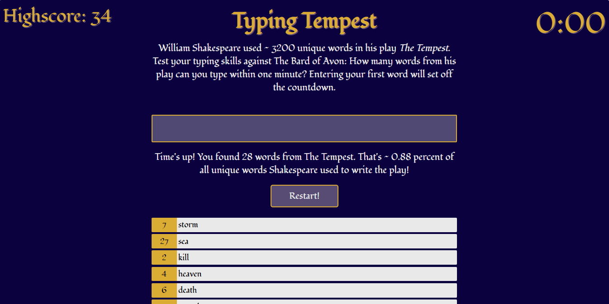

# Typing Tempest

**Typing Tempest** is an engaging and educational typing game where players race against the clock to type as many words from Shakespeare's *The Tempest* as possible in one minute. Test your knowledge of the Bard's iconic play and improve your typing speed in this fun and challenging game!

## Features
* **Typing Challenge:** Type as many words from *The Tempest* as you can in one minute.

* **Real-Time Feedback:** See each word and the number of times it appears in the play immediately after typing.

* **Dynamic Timer:** A countdown timer starts when you type your first word, adding to the challenge.

* **Score Display:** At the end of the game, see how many words you typed and your final score.

* **High Score Tracking:** Keeps track of the highest score achieved during the session.

* **Restart Functionality:** Allows you to reset the game to start a new challenge.



## Built with
* [ReactJS](https://react.dev/) - A JavaScript library for building user interfaces

## Getting started

Follow these steps to run **Typing Tempest** on your machine.

### Prerequisites

* Node.js
* npm (Node Package Manager)

### Installation

1. Clone the repository:
```git clone https://github.com/lseegets/typing-tempest.git```

2. Navigate to the project directory:
```cd typing-tempest```

3. Install the dependencies:
`npm install`

4. Start the development server:
`npm start`

## Usage
* Type words from *The Tempest* as fast as you can.
* Each correctly typed word is displayed with the number of times it appears in the play.
* The timer starts counting down from 60 seconds as soon as you type your first word.
* At the end of the game, you will see how many words you have typed and your final score.
* Click the "Reset Game" button to restart the challenge.

## Acknowledgments

This project was inspired by a Vanilla JavaScript practice exercise of the University of Regensburg. The following modifications were made:

* Enhanced and rebuilt with ReactJS to demonstrate component-based architecture and state management.
* Changed the project name to Typing Tempest.
* Updated the game to use words from Shakespeare' *The Tempest*.
* Adjusted the font and color scheme.
* Added a reset button to restart the game.
* Added a high score display.


### Data Source

The word list was created using data from [*Folger Shakespeare Library*](https://shakespeare.folger.edu/download/) corpus provided under [CC BY-NC 3.0](https://creativecommons.org/licenses/by-nc/3.0/deed.en_US) license.

Favicon by [Flaticon](https://www.flaticon.com/free-icons/manuscript).
